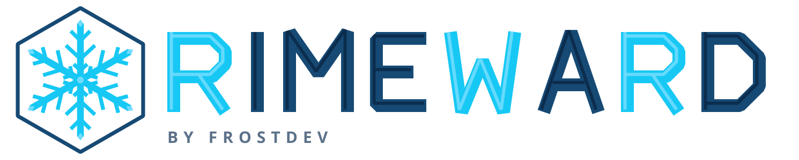
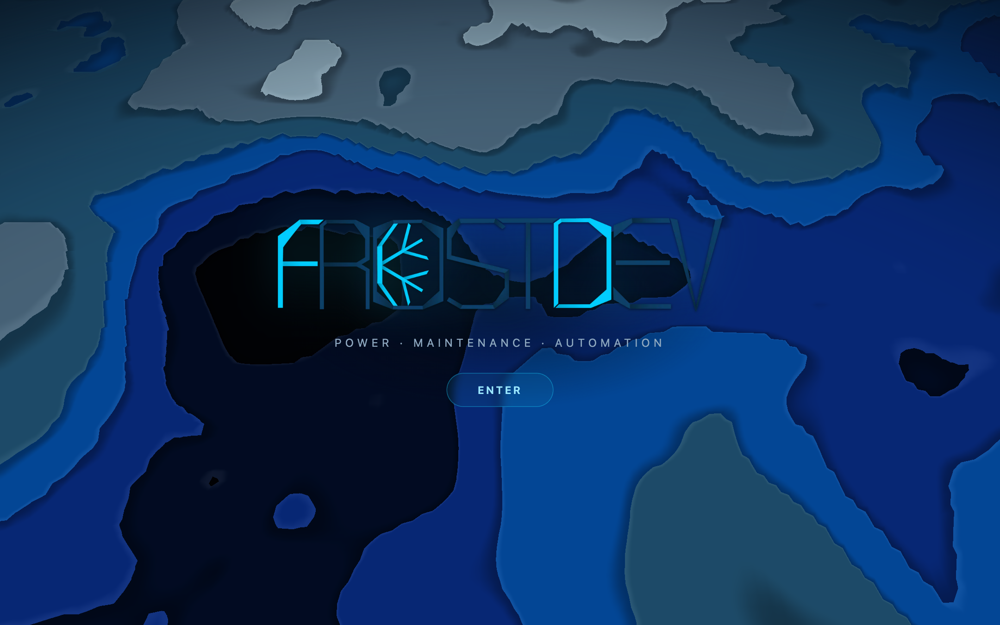
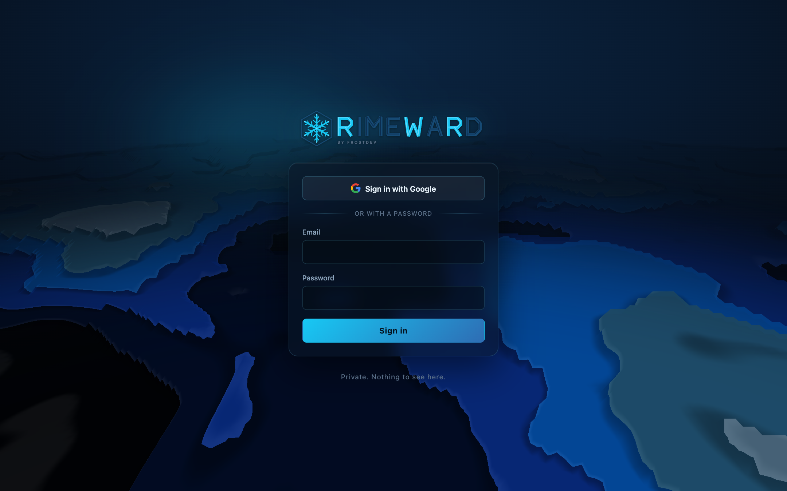
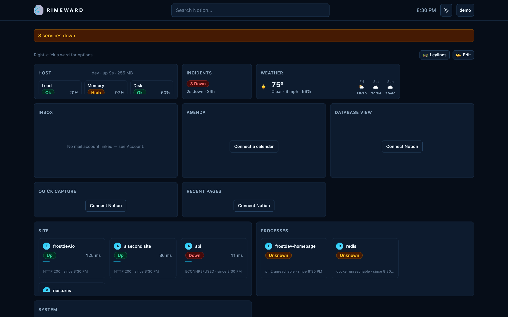

<p align="center">
  
</p>

<p align="center">
  The public splash at <a href="https://frostdev.io">frostdev.io</a>, the <b>Rimeward</b> dashboard behind the login, and the Rimeward desktop app.
  <br>
  <a href="https://github.com/frostdev-ops/frostdev-homepage/releases/latest">Latest desktop release</a> · macOS (signed, universal) · Windows · Linux
</p>

Rimeward is a personal operations dashboard: live service status for your own servers,
weather, one inbox over every linked mailbox, a merged agenda, Notion wards, a notepad,
routine timers, chat wards (Discord, Telegram, Slack, Twilio, push, Matrix, Teams), a real
browser you and the built-in agent drive together, and **leylines**, a small automation graph
that wires any of it to any of it.

## Screens

<p align="center">
  
</p>
<p align="center">
  
  
</p>

Regenerate them with `node ops/goldens.mjs` (a throwaway instance, nothing personal in them).

## Stack

Astro 5 (SSR, Node adapter) · TypeScript · Tailwind 4 · SQLite (`better-sqlite3`) · three.js
for the splash · Playwright for the browser wards · Tauri 2 (Rust) for the desktop app.

## Run it

```sh
npm install
cp .env.example .env            # fill in what you use; TOKEN_ENC_KEY is required
cp src/lib/targets.example.json src/lib/targets.json   # what the status wards monitor
npm run dev:env                 # http://localhost:4321 (.env loaded)
npm test                        # node --test
npm run build && npm run preview
```

The first user to sign in becomes the admin. `server.mjs` is the production entry (Astro's
standalone server plus the websocket upgrade the desktop app needs); run it behind a reverse
proxy that passes `Upgrade` headers on `/api/tunnel`.

## Desktop app

`desktop/` is a Rust-only Tauri 2 app whose window loads the dashboard. It keeps a tunnel open
to the server so a browser ward can either egress from your own connection or run its Chromium
on your machine entirely, driven from the dashboard and by the agent alike.

```sh
cargo install tauri-cli --locked
npm run desktop:dev             # against the dev server
npm run desktop:build
```

Releases are built by `.github/workflows/desktop.yml` on a `desktop-v*` tag.

## Layout

- `src/pages` routes · `src/lib` the server (auth, wards, status, logic engine, agent, tunnel,
  browser sessions, comms) · `src/scripts/app` the dashboard client · `src/styles/frost.css`
  the token system
- `migrations/` numbered SQL, applied on first open
- `desktop/` the Tauri app · `ops/rimeward-brand.mjs` regenerates the mark, lockup and icon

## License

[MIT](LICENSE)
