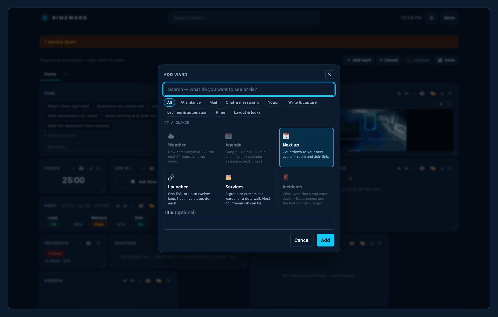
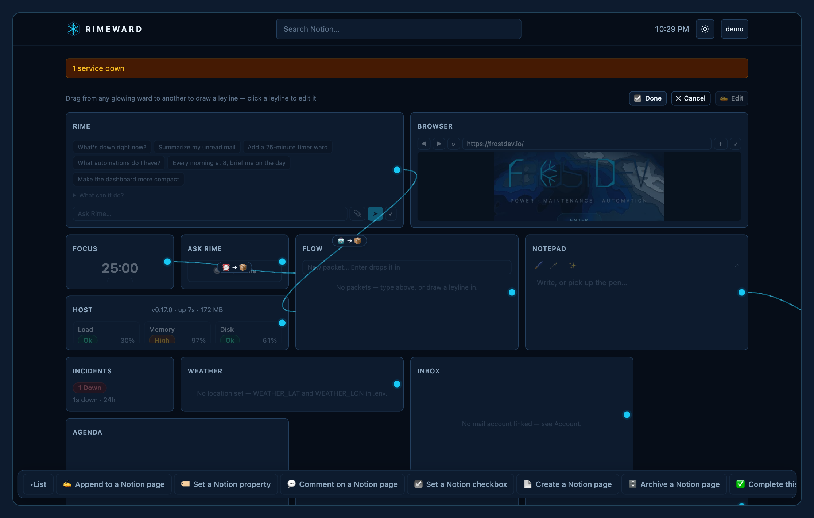
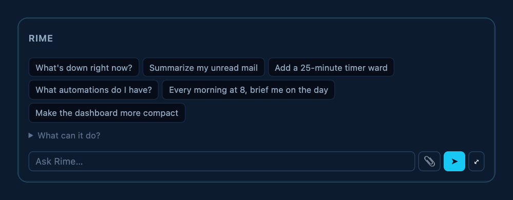
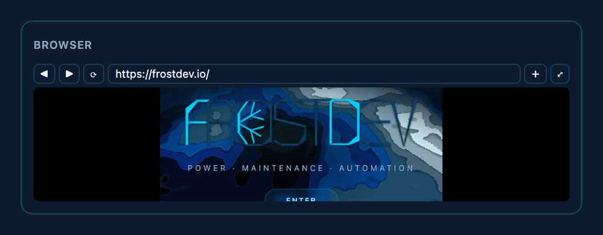

<p align="center">
  
</p>

<p align="center">
  A personal operations dashboard, the splash in front of it, and a desktop app that lends it your own connection.
  <br>
  <a href="https://github.com/frostdev-ops/frostdev-homepage/releases/latest">Latest desktop release</a> · macOS (signed, universal) · Windows · Linux
</p>

Rimeward is a personal operations dashboard: live service status for your own servers,
weather, one inbox over every linked mailbox, a merged agenda, Notion wards, a notepad,
routine timers, chat wards (Discord, Telegram, Slack, Twilio, push, Matrix, Teams), a real
browser you and the built-in agent drive together, and **leylines**, a small automation graph
that wires any of it to any of it.

## Screens

<p align="center">
  
</p>
<p align="center">
  
</p>

## The words

Rimeward has its own vocabulary, and the code follows it.

**Rimeward** is the dashboard behind the login and the desktop app; the splash in front of it
says whatever your instance's site settings say. Rime is the frost that grows on the windward
side of things; Rimeward is where you keep watch.

A **ward** is one card on the dashboard. Every ward is one thing to watch or one thing to do: the
weather, an inbox, a Notion database, a routine timer, a real browser. Wards come from a catalog,
grouped by what they are for: *At a glance*, *Mail*, *Chat & messaging*, *Notion*, *Write &
capture*, *Leylines & automation*, *Rime*, and *Layout & looks*. Wards live on **pages**, the tabs
across the top; a **container** groups wards; a **spacer** is breathing room.

<p align="center">
  
</p>

A **leyline** is a wire from something that happens in one ward to something another ward does:
a routine finishing, a button being pressed, a service going down, mail arriving, a message in a
chat, the weather turning; then a timer starts, a Notion task is checked, a message is sent, a
flow packet moves, Rime is asked. A leyline can carry conditions, and every leyline is one
trigger, one action; fan-out is more leylines. **Leylines mode** is where you draw them, across
every page at once.

<p align="center">
  
</p>

**Rime** is the agent that lives in the dashboard. It reads the same wards you do, keeps its own
memory and skills as wards, drives the same browser you drive, and asks before anything leaves
the building: mail, chat, and the rest of the outbound tools wait for a confirm. A **routine** is
a timer with rounds. A **packet** is what moves between flow wards. The **home route** is the
desktop app's tunnel: a browser ward on the server egressing from your own connection, or running
its Chromium on your machine entirely.

<p align="center">
  
  
</p>

In the code the words keep their engineering names where they were there first: a ward is a
`WardInstance` from the `CATALOG` in `src/lib/wards.ts`; leylines are logic edges in
`src/lib/logic*.ts` (triggers, conditions, actions, the `.wiring` mode); Rime is `src/lib/agent/`.
User-facing copy always says ward, leyline, Rime.

## Stack

Astro 5 (SSR, Node adapter) · TypeScript · Tailwind 4 · SQLite (`better-sqlite3`) · three.js
for the splash · Playwright for the browser wards · Tauri 2 (Rust) for the desktop app.
Node 22.18 or newer.

## Run it

```sh
npm install
cp .env.example .env            # PUBLIC_BASE_URL and TOKEN_ENC_KEY are required
node bin/rimeward.mjs users create you@example.com --admin   # prints the password once
npm run dev:env                 # http://localhost:4321 (.env loaded)
npm test                        # node --test
npm run build && npm run preview
```

`node bin/rimeward.mjs doctor` lists what is still missing. The CLI also manages users,
settings, the splash, the brand files, and backups (`--help`).

## Configure

Everything an instance is comes from `.env`, the settings table, and the data directory. The
repo carries nothing of yours.

| Variable | What it is |
|---|---|
| `PUBLIC_BASE_URL` | The URL people reach the site on. Redirect URIs, the CSRF check and the Secure cookie flag derive from it. |
| `PORT`, `HOST` | `3005` and `127.0.0.1` behind a reverse proxy; `0.0.0.0` in a container. |
| `HOMEPAGE_DATA_DIR` | The database, uploads, browser profiles and the agent's files. Default `./data`. |
| `TOKEN_ENC_KEY` | 32 bytes base64. Seals every stored credential; part of every backup. |
| `GOOGLE_CLIENT_ID/SECRET` | Google sign-in and the Gmail / Calendar links. |
| `SSO_WORKSPACE_DOMAIN` | A Google Workspace domain that may sign in without an invite (its first user becomes admin). Unset: invited addresses only. |
| `MS_CLIENT_ID/SECRET`, `MS_TENANT_ID` | Outlook and Teams. The tenant defaults to `common`. |
| `NOTION_CLIENT_ID/SECRET`, `ZOHO_CLIENT_ID/SECRET` | Notion pages and databases; Zoho Mail. |
| `WEATHER_LAT`, `WEATHER_LON` | The weather ward's location (or the `weather_lat` / `weather_lon` settings). |
| `BROWSER_EXECUTABLE`, `BROWSER_PROFILES` | A Chromium (or a wrapper that drops root) and where its profiles live. Unset: playwright-core's own, under the data dir. |
| `PM2_BIN`, `DOCKER_BIN`, `SYSTEMCTL_BIN` | The tools behind pm2 / docker / systemd monitor targets when PATH does not carry them. |
| `PUBLIC_APP_BUILD` | The build stamp on the dashboard. Default: the package version. |
| `TZ` | Set in the process manager, not `.env`: the logic engine's clocks and due dates run in it. |

**Site and brand.** The name, tagline, splash cards and footer are settings, edited on the
admin page or with `node bin/rimeward.mjs splash`. The wordmark, emblem, header mark and icons
are files in `data/brand/` (`brand install <slot> <file>` normalises them); without one the
Rimeward crystal serves.

**Monitoring.** `src/lib/targets.json` (created from the example on first run, never
committed) is what the Services wards watch: `http` and `tcp` probes, and the pm2 processes,
docker containers and systemd units of the machine the app runs on — it sees no other machine.

```json
{ "id": "web",   "label": "web",   "group": "processes", "kind": "pm2",     "name": "web" }
{ "id": "cache", "label": "redis", "group": "processes", "kind": "docker",  "container": "redis" }
{ "id": "proxy", "label": "nginx", "group": "system",    "kind": "systemd", "unit": "nginx" }
```

**Browser wards** drive playwright-core's Chromium (`npx playwright-core install chromium`). Run
the server as a non-root user, or point `BROWSER_EXECUTABLE` at a wrapper that drops root; as
root without one, Chromium runs without its sandbox. Every host a user names is checked against
the private address ranges before it is dialled, the Docker bridge range included — reach a
sibling container by its public name or with host networking.

## Deploy

`server.mjs` is the production entry: Astro's standalone server plus the websocket upgrade the
desktop app needs. Run it under a process manager with `.env` loaded
(`node --env-file=.env server.mjs`, `TZ` set there too) behind a reverse proxy that does not
buffer `/api/status/stream` and `/api/browser/stream` and passes `Upgrade` on `/api/tunnel`.
`ops/nginx.example.conf` is that proxy. Give the process ten seconds to stop: browser wards
close Chromium gracefully so a fresh login's cookies are not lost.

**Docker.** `compose.yaml` builds the image, keeps the data directory in a volume, and runs
Chromium with the seccomp profile that lets it keep its sandbox as a non-root user.

```sh
cp .env.example .env            # HOST is set by the image; PUBLIC_BASE_URL is yours
docker compose up -d --build
docker compose exec app node bin/rimeward.mjs users create you@example.com --admin
```

**Back up** the whole data directory and `TOKEN_ENC_KEY`: `node bin/rimeward.mjs backup <dir>`
takes an online copy of the database and the files beside it. The database alone restores to an
agent with no memory and tokens nobody can decrypt.

**Limits, on purpose.** Per user and hour: 10 mails, 30 button presses, 60 one-shot model
calls, 60 chat messages (20 SMS), and each Rime ward's own cap on unattended turns. One server
timezone. The login throttle keys on the address the server sees, which behind a proxy is the
proxy's — stricter than trusting a forwarded header without a trusted-proxy list.

## Desktop app

`desktop/` is a Rust-only Tauri 2 app whose window loads the dashboard. It keeps a tunnel open
to the server so a browser ward can either egress from your own connection or run its Chromium
on your machine entirely, driven from the dashboard and by the agent alike.

```sh
cargo install tauri-cli --locked
npm run desktop:dev             # against the dev server
RIMEWARD_ORIGIN=https://dash.example.com npm run desktop:build
```

The server a build opens is compiled in (`RIMEWARD_ORIGIN`, default the upstream instance):
`desktop/prebuild.mjs` writes it into the window URL and the capability that lets that page
reach the app. Releases are built by `.github/workflows/desktop.yml` on a `desktop-v*` tag; a
fork sets the `RIMEWARD_ORIGIN` repository variable, its own bundle identifier in
`desktop/tauri.conf.json`, and the Apple secrets the workflow lists.

## Layout

- `src/pages` routes · `src/lib` the server (auth, site, brand, wards, status, logic engine,
  agent, tunnel, browser sessions, comms) · `src/scripts/app` the dashboard client ·
  `src/styles/frost.css` the token system
- `bin/rimeward.mjs` the CLI · `migrations/` numbered SQL, applied on first open
- `desktop/` the Tauri app · `ops/` the nginx example, the seccomp profile, the brand and
  goldens generators

## License

[MIT](LICENSE)
